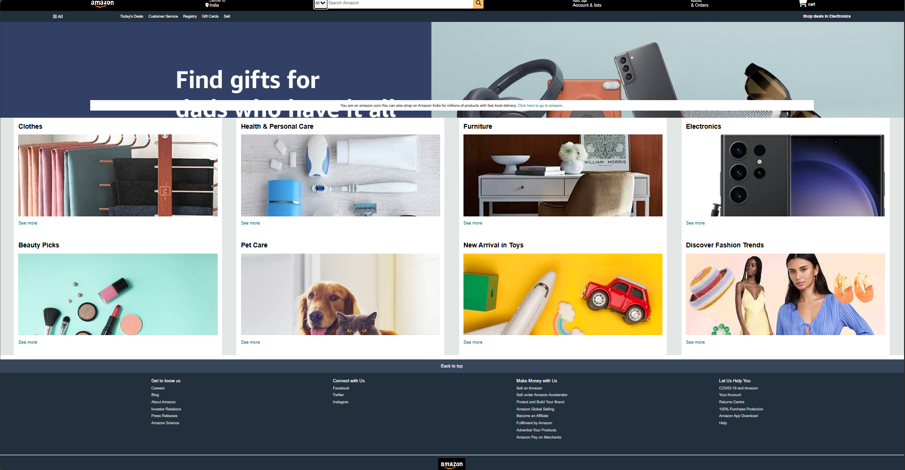

# Amazon Clone 🛒

## 📚 Project Overview
This is a responsive Amazon clone website built using **HTML** and **CSS**. The project replicates Amazon's homepage layout, including a dynamic navbar, product sections, and a footer.

---

## 🚀 Features
- **Responsive Navbar**: Includes search bar, sign-in option, and cart icon.
- **Hero Section**: Highlighting a key message with a CTA.
- **Product Categories**: Displayed in a flexible grid layout.
- **Hover Effects**: Smooth animations for better user experience.
- **Footer**: Clean design with multiple useful links.

---

## 🛠️ Technologies Used
- **HTML5**: Structuring the webpage.
- **CSS3**: Styling with Flexbox, Grid, and custom animations.
- **Font Awesome**: For icons.

---

## 📁 Folder Structure
 ``` lua
    /project-root
        │-- amazon_logo.jpeg
        │-- hero_image.jpg
        │-- style.css
        │-- index.html
        |-- Images
```

## 📸 Amazon Clone Wed Page

---

## 🚀 Conclusion
 This project successfully recreates a visually appealing and responsive Amazon-inspired webpage using HTML and CSS. Through this process, we explored key concepts such as layout structuring, flexbox/grid systems, and image handling. The project not only highlights modern web design techniques but also emphasizes the importance of user interface aesthetics and functionality.

 Moving forward, additional enhancements could include integrating JavaScript for dynamic interactions, optimizing images for faster loading, and ensuring accessibility compliance. This project serves as a strong foundation for further development, aiming to create more robust and user-centric web applications.